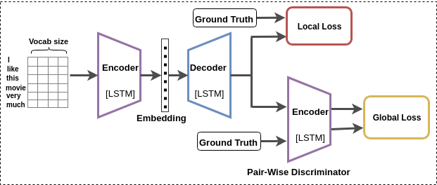

# Learning Semantic Sentence Embeddings using Pair-wise Discriminator

Torch code for Parapharse Question Generation. For more information, please refer the  [paper](https://arxiv.org/abs/1806.00807)

 

### Requirements
This code is written in Lua and requires [Torch](http://torch.ch/). The preprocssinng code is in Python, and you need to install [NLTK](http://www.nltk.org/) if you want to use NLTK to tokenize the question.

- pip install nltk

You also need to install the following package in order to sucessfully run the code.

- [torch-hdf5](https://github.com/deepmind/torch-hdf5)
- [lua-cjson](http://www.kyne.com.au/~mark/software/lua-cjson.php)
- [loadcaffe](https://github.com/szagoruyko/loadcaffe)


### Training

We have prepared everything for you ;)


##### Download Dataset
We have referred  [neuraltalk2](https://github.com/karpathy/neuraltalk2) and [Text-to-Image Synthesis ](https://github.com/reedscot/icml2016) to prepare our code base.

The first thing you need to do is to download the Quora Question Pairs dataset from the [Quora Question Pair website](https://data.quora.com/First-Quora-Dataset-Release-Question-Pairs) and put the same in the `data` folder. 

If you watn to trained from scratch countinue reading or if you want to evalute using pretrained model then head over to `Datafiles` section and download the data files (put all the data files in the `data` folder)and pretrained model( put this in the 'pretrained' folder) and run `eval.lua` 

Now we need to do some preprocessing, head over to the `prepro` folder and run

```
$ python quora_prepro.py
```

**Note** The code given above generates json files for 100K question pairs for train, 5k question pairs for validation and 30K question pairs for Test set. 
If you want to change this and instead use only 50K question pairs for training and rest remaining the same, then you need to make some minor changes in the above code. After this step, it will generate the files under the `data` folder. `quora_raw_train.json`, `quora_raw_val.json` and `quora_raw_test.json`

##### Generate Question Features

```
$ python prepro_quora.py --input_train_json ../data/quora_raw_train.json --input_test_json ../data/quora_raw_test.json 
```
to get the question features. This will generate two files in `data/` folder, `quora_data_prepro.h5` and `quora_data_prepro.json`.


##### Train the model

We have everything ready to train the Question paraphrase model. Back to the root directory

```
th train.lua -input_ques_h5 data/quora_data_prepro.h5 -input_json data/quora_data_prepro.json 
```

### Evaluate the model
In root folder run 

```
th eval.lua -input_ques_h5 data/quora_data_prepro.h5 -input_json data/quora_data_prepro.json 
```

##### Metric

To Evaluate Question paraphrase, you need to download the [evaluation tool](https://github.com/tylin/coco-caption). To evaluate Questio Pair , you can use script `myeval.py` under `coco-caption/` folder. If you need to evaluate based on Bleu,Meteor, Rouge and Cider score . Follow All the instruction from this link [here](https://github.com/tylin/coco-caption)


##### For calculating the TER score
 This code is taken from the [OpenNMT repo]( http://opennmt.net/OpenNMT/tools/scorer/)

Step1: Put the results checkpoint json file inside the folder check_point_json

Step2: Rename the check point json file to resuts_json 

Step3: Rename the ground truth json file to quora_prepro_test_updated_int_4k

Step4: Run the ./score.sh file


### Data Files
Download all the data files from here.
- [quora_data_prepro.h5](https://figshare.com/s/5463afb24cba05629cdf)
- [quora_data_prepro.json](https://figshare.com/s/5463afb24cba05629cdf)
- [quora_raw_train.json](https://figshare.com/s/5463afb24cba05629cdf)
- [quora_raw_val.json](https://figshare.com/s/5463afb24cba05629cdf)
- [quora_raw_test.json](https://figshare.com/s/5463afb24cba05629cdf)

### Evaluate using Pre-trained Model
The pre-trained model can be download [here](https://figshare.com/s/999a13965bbbd1c87cd3).


### Reference

If you use this code as part of any published research, please acknowledge the following paper

```
@article{patro2018learning,
  title={Learning Semantic Sentence Embeddings using Pair-wise Discriminator},
  author={Patro, Badri N and Kurmi, Vinod K and Kumar, Sandeep and Namboodiri, Vinay P},
  journal={arXiv preprint arXiv:1806.00807},
  year={2018}
}
```

## Contributors

* [Badri N. Patro][1] (badri@iitk.ac.in)
* [Vinod K. Kurmi][2] (vinodkk@iitk.ac.in)
* [Sandeep Kumar][3] (sandepkr@iitk.ac.in)

[1]: https://github.com/badripatro
[2]: https://github.com/vinodkkurmi
[3]: https://github.com/krsandeep98
